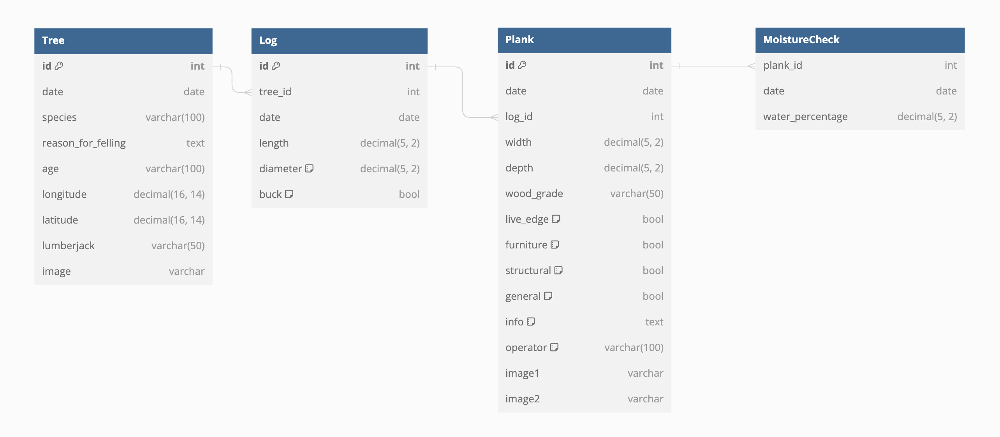

# SAWMILL GO! 

## Table of Contents

| Section | Description |
| ------- | ----------- |
| Project Introduction | Briefly introduces the project and its goals. |
| Site Architecture | Lists the technology stack used in the project. |
| Database Structure | Lists the technology stack used in the project. |
| Current Status | Provides an overview of the project's current status. |
| Future Development | Outlines the planned future development of the project. |

## Project Introduction

I am the owner of a sawmill and forest in the North of Sweden. After studying programming in 2022, I embarked on creating this project during the summer of 2023.

### Project Goals:

- Develop an easy-to-use management system for processed timber (planks/lumber).
- Promote sustainable forest management, emphasizing selective cut forestry over clear-cut forestry.
- Establish a transparent process that fosters an emotional connection between the end buyer/user and the timber. This transparency is achieved through sharing information about the people involved in the process, GPS data on tree locations, images, and comments on why and when the tree was removed and where it was processed.

### Distinctive Products:

1. **Sawmill Stock Management System**: A comprehensive database system tailored specifically for artisanal sawmills, ensuring seamless and hassle-free management of all inventory operations.

2. **Transparent Forestry System with Certification/Customer Report**: This advanced system creates a transparent and traceable process that allows end buyers and customers to gain complete information about the sourced trees. From the date of felling to responsible individuals, precise locations, and more, this unique product provides a distinctive offering, fostering a strong emotional connection to the timber.

## Site Architecture

The Sawmill Go application follows a modern and scalable architecture to ensure efficient and maintainable development. The project's architecture can be summarized as follows:

- **Frontend**: The frontend of the application is built using JSReact, a popular JavaScript library for creating user interfaces. It is deployed using GitHub Pages, providing easy access to users.

- **Backend**: The backend is powered by Django Python, a powerful web framework that enables smooth back-end development. The backend APIs are deployed on Heroku, ensuring robust performance and scalability.

- **Media Storage**: Images and videos are seamlessly uploaded, optimized, and delivered to users through Cloudinary, a cloud-based media storage solution.

- **Database Storage**: The application's data is hosted and managed on Heroku's scalable and user-friendly cloud platform.

- **External APIs**: JavaScript MAPS API is integrated into the frontend, allowing interactive maps and geolocation functionality for enhanced user experience.

The project's architecture prioritizes performance, security, and user experience, enabling smooth management of processed timber data and promoting transparent forestry practices.

## Database Structure
### Current Models

### Reasoning
The database structure consists of several main tables that form the foundation of the application's data management. Key tables include:

- **Tree**: Stores information about individual trees, such as date of felling, species, and location.
- **Log**: Relates each tree to its corresponding log, including log length, diameter, and buck status.
- **Plank**: Represents processed timber planks, containing details like width, depth, wood grade, and usage type.
- **MoistureCheck**: Tracks moisture content checks for each plank to ensure quality control.

## Current Status
I am working on getting a basic verison of the software ready for testing / sharing with the community. Currently the databases are in place and talking to the frontend. Image storage, GPS location storage and CRUD functionality are working on all databases.

### The good  
- Basic Site arcitecture is complete  
- Backend API is up and running with key databases created and working well
- API is secured with login tokens and refresh tokens functioning
- Frontend is linked to the API for POST, PUT and GET functions 
- Frontend POST and PUT form views created
- Detailed GET filtering created for 'Plank' database
- Image POST, PUT and GET working from frontend to Cloudinary
- GPS location stored via mobile phone GPS functionality
- Javascript MAPS API intergrated and showing current / stored locations
- Basic frontend site navigation in place
- UX Design has been started - A color palett and styling decided
- How process is working. The frontend can produce a 'report' of the complete process. 

### The Bad
- Site styling on home page but currently no styling on rest of site.
- Pagination bugs on somse frontened list views
- Auto logout and refresh not functioning

### The Ugly
- Structure and file management of the Django backend could be improved by seperating the models into seperate apps
- Removal off all test Models, Views, URLS on backend
- No 404 view in place
- No user feedback on input / edit forms

## Future Development

### Minimum Viable Product (MVP) & Testing

To prepare the software for sharing and testing, the following key milestones will be achieved:

- **Frontend Styling**: Enhance the frontend's visual appeal and user experience, making it more engaging and user-friendly.
- **Clear About Page**: Create an informative about page with visuals that effectively explain the functionality of both systems.
- **Database Demo**: Develop a demo version of the database, allowing visitors to explore and search parts of the system without requiring login credentials.
- **Certification/Transparent Forestry View**: Design a dedicated view that showcases the transparency and certification aspect, demonstrating what end users will experience when scanning a product's QR code.

### Feedback and Community Engagement

In the near future, focus will be on frontend development, enabling the project's initial sharing and testing phase from July to October 2023. The feedback collected during this period will be instrumental in refining and enhancing the project.

The engagement with various stakeholders will be as follows:

1. **The Community**: Once the frontend is in place, featuring a demo searchable database and screenshots of different input views, it will be shared with the sawmill online community to gather feedback and initial impressions.

2. **Woodworkers and Creators**: With a clear demonstration of the transparent forestry process and a frontend display of the end user's perspective through the product's QR code, the project will be shared with woodworkers and creators, seeking their valuable feedback.

3. **Re-sellers & Shops**: The frontend view, portraying what customers will experience through the product's QR code, will be presented to high-end shops to gauge their interest and gather insights into the market potential.

4. **Conservation and Environmental Grants and Bodies**: Once the frontend effectively conveys the system's essence, the project will be shared with conservation and environmental groups to receive feedback on how it aligns with their interests in protecting forests and supporting rural farmers, foresters, and landowners.

This feedback-driven approach will guide the project's future development, ensuring it meets the needs of various stakeholders and fulfills its goals of promoting sustainable forest management and transparent forestry practices.

